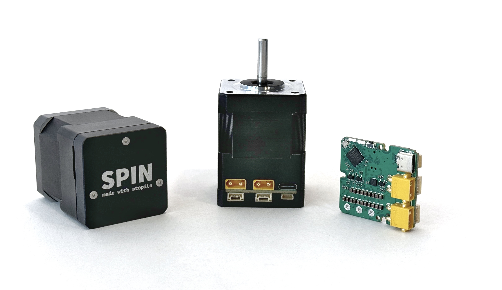
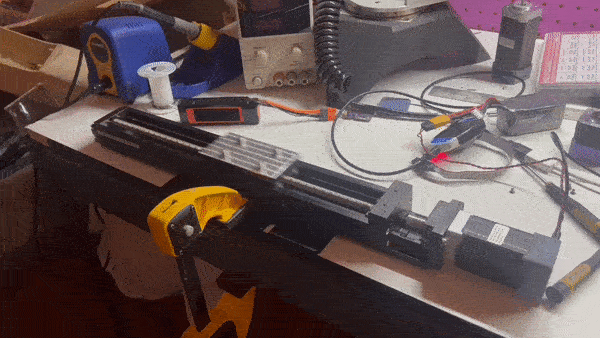
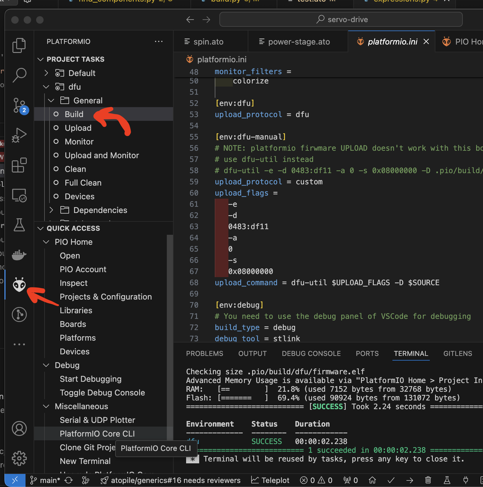
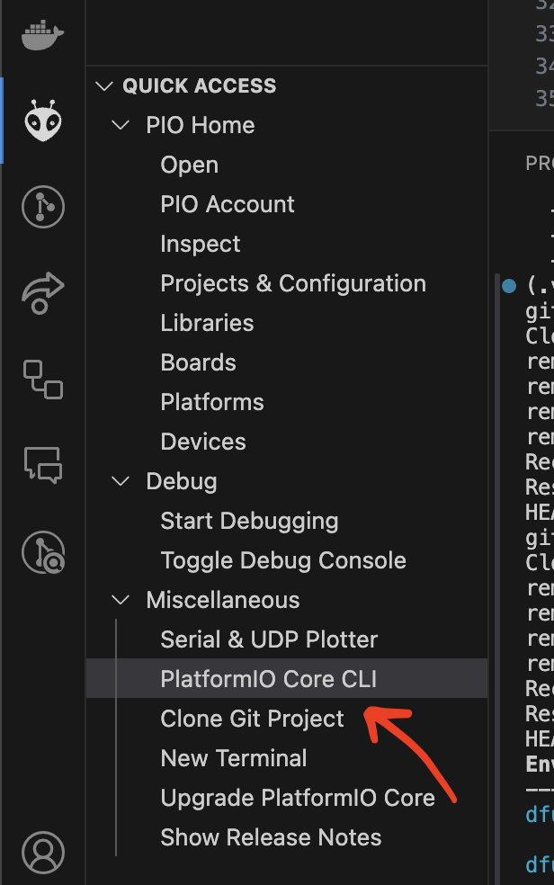

# Servos are dope.

Compared to the steppers we stick on our 3D printers, CNC machines and paintball turrets:
 - They're way faster 🏃
 - Far more powerful (higher torque for longer) 💪
 - More accurate (higher resolution) 🎯
 - And they're closed loop (they know where they are) 🤖

The only downside is that they're expensive, like hundreds of dollars.

Introducing spin ✨ - the $30 servo for the masses (designed with atopile)

## Wiggle wiggle wiggle

## Build your own Spin Servo Motor Drive

This project is fully open source and designed with [atopile](https://github.com/atopile/atopile), a new language and compiler to design electronics with code.

**Latest auto-generated artifacts**

[Electronics: Gerbers, Bill of material, position files](https://atopile.s3.amazonaws.com/spin/electronics/electronics_build_artifacts.zip)

[Firmware](https://atopile.s3.amazonaws.com/spin/firmware/firmware_build_artifacts.zip)

[3D Files (PDFs, STEP files in the future)](https://atopile.s3.amazonaws.com/spin/mechanics/3D_files.zip)

## Goals + (default) Specs

- Obviously better option than stepper motors for 3D printers, CNC machines and robotics
- Open-source design that is easy to:
  - contribute to
  - fork maintainable derivatives of
  - robust

- 2x CAN comms with JST-GH connectors
- XT30 power connector
- 0.25Nm continuous rated torque (0.75Nm peak)
- <0.1° resolution
- 12V-24V input voltage

## Getting started

This project was written in `ato`, a new electronics description language we are developing to help create and share electronic designs. Get started here: https://atopile.io/getting-started

### Electronics

**Write me please!**

### Firmware

Install [PlatformIO](https://platformio.org/) into VSCode. It has the utilities to build, upload and debug the firmware.

You may also need to install `libusb` (eg. `brew install libusb` on OSx) to run the build!

There are a few build configurations:
- `debug` is intended as a JTAG configuration and includes symbols to run the debugger.
- `dfu-manual` uses the GNU command-line dfu-utility to trigger the upload via USB (**Recommended USB workflow**)
- `dfu` uses the built-in PlatformIO dfu utility to program via USB (which **I struggled with on OSx**)

To run a build either use the sidebar (easiest IMO) or PlatformIO CLI (`pio run --help`).

#### Side-bar

#### CLI

